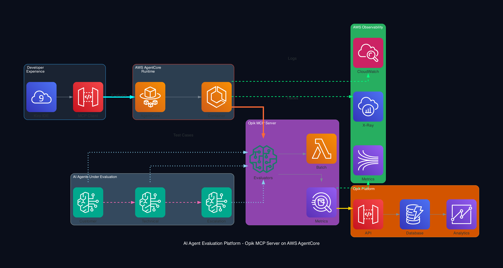
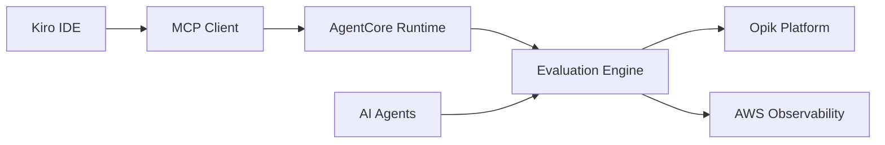

# 🚀 Opik MCP Server - Production-Ready AI Agent Evaluation on AWS AgentCore

<div align="center">



[](LICENSE)
[](https://docs.aws.amazon.com/bedrock/latest/userguide/agents-agentcore.html)
[](https://modelcontextprotocol.io/)
[](https://www.comet.com/site/products/opik/)

**🎯 The first production-ready MCP server for comprehensive AI agent evaluation with real-time observability**

*Evaluate single agents and multi-agent workflows with specialized metrics, deployed on AWS AgentCore serverless runtime*

[🚀 Quick Start](#-quick-start) • [📖 Documentation](#-documentation) • [🎯 Features](#-features) • [🏗️ Architecture](#️-architecture) • [🤝 Contributing](#-contributing)

</div>

---

## 🌟 Why This Matters

AI agents are moving to production, but **evaluation is still stuck in notebooks**. This changes everything:

- ✅ **Production-Ready**: Deploy evaluation as a service, not a script
- ✅ **Multi-Agent Aware**: Specialized metrics for Agent-to-Agent workflows  
- ✅ **Real-Time Observability**: CloudWatch + X-Ray + EMF metrics out of the box
- ✅ **Developer Experience**: Evaluate directly from Kiro IDE via MCP protocol
- ✅ **Serverless Scale**: AWS AgentCore handles scaling automatically

## 🎯 Features

### 🔍 Comprehensive Evaluation Metrics

**Single Agent Metrics:**
- **Accuracy** - How correct are responses?
- **Relevance** - How well does it address the query?
- **Helpfulness** - How useful is the response?
- **Coherence** - How well-structured is the output?
- **Factuality** - How factually accurate is the information?

**Multi-Agent Metrics:**
- **Conversation Quality** - Natural inter-agent communication
- **Agent Coordination** - Task handoff effectiveness  
- **Workflow Efficiency** - Multi-agent system optimization
- **A2A Protocol Compliance** - Agent-to-Agent standard adherence

### 🏗️ Production Architecture

- **🐳 Containerized Deployment** on AWS AgentCore
- **📊 Real-time Observability** with CloudWatch, X-Ray, EMF
- **🔄 Auto-scaling** from 1-5 replicas based on load
- **⚡ Fast Performance** - <2s cold start, ~100ms evaluation
- **🔒 Secure** - IAM roles, VPC isolation, encrypted data

### 🛠️ Developer Experience

- **🎨 Kiro IDE Integration** - Evaluate without leaving your editor
- **📝 Natural Language** - "Evaluate my customer service agent with accuracy metrics"
- **🔄 Batch Processing** - Test multiple agents simultaneously
- **📈 Historical Tracking** - Opik platform integration for trends

## 🚀 Quick Start

### Prerequisites

- AWS CLI configured with appropriate permissions
- Python 3.11+ with UV package manager  
- [AgentCore CLI](https://docs.aws.amazon.com/bedrock/latest/userguide/agents-agentcore.html) installed
- [Opik API key](https://www.comet.com/site/products/opik/)

### 1-Minute Setup

```bash
# Clone and setup
git clone https://github.com/anespo/opik-mcp-server.git
cd opik-mcp-server

# Configure environment
cp .env.example .env
# Edit .env with your credentials

# Deploy to AgentCore (takes ~2 minutes)
./scripts/deploy.sh deploy

# Test the deployment
./scripts/deploy.sh test
```

### Kiro IDE Integration

```bash
# Copy MCP configuration
cp kiro-integration/mcp.json ~/.kiro/settings/
# Restart Kiro IDE
```

Now you can evaluate agents directly from Kiro:

```
Evaluate my customer service agent with accuracy and relevance metrics using these test cases:

Test Case 1:
- Input: "I need help with my order"  
- Expected: "I'll help you with your order inquiry"
- Context: Customer service scenario
```

## 🏗️ Architecture

### System Components

1. **🎨 Developer Layer** - Kiro IDE with MCP client integration
2. **☁️ AWS AgentCore** - Serverless container runtime  
3. **🧠 Opik MCP Server** - FastMCP-based evaluation engine
4. **📊 Opik Platform** - Cloud evaluation tracking and analytics
5. **👁️ AWS Observability** - CloudWatch, X-Ray, EMF metrics
6. **🤖 Agent Systems** - Your AI agents under evaluation

### Evaluation Flow



## 📊 Real-World Performance

**Production Metrics:**
- **Cold Start**: < 2 seconds on AgentCore
- **Evaluation Speed**: ~100ms per single agent test case  
- **Multi-Agent Evaluation**: ~200ms per workflow
- **Concurrent Processing**: Up to 10 parallel evaluations
- **Auto-scaling**: 1-5 replicas based on load

## 🎯 Usage Examples

### Single Agent Evaluation

```python
# Via Kiro IDE or direct MCP call
evaluation_result = await evaluate_agent(
    agent_id="customer-service-agent",
    test_cases=[
        {
            "input": "I need help with my order #12345",
            "expected_output": "I'll help you check your order status", 
            "context": {"scenario": "order_inquiry"}
        }
    ],
    evaluators=["accuracy", "relevance", "helpfulness"],
    project_name="customer-service-evaluation"
)
```

### Multi-Agent Workflow Evaluation

```python
# Evaluate Agent-to-Agent coordination
workflow_result = await evaluate_multiagent_workflow(
    workflow_id="customer-support-escalation",
    workflow_type="agent2agent", 
    agents=["intake-agent", "technical-agent", "escalation-agent"],
    conversation_messages=[
        {
            "from_agent": "intake-agent",
            "to_agent": "technical-agent", 
            "message": "Customer reports login issues with premium account",
            "metadata": {"priority": "high", "account_type": "premium"}
        }
    ],
    evaluators=["conversation_quality", "agent_coordination", "workflow_efficiency"]
)
```

## 📖 Documentation

- **[Deployment Guide](DEPLOYMENT.md)** - Complete setup and deployment instructions
- **[Testing Guide](REAL_TESTING_GUIDE.md)** - Real-world testing scenarios  
- **[Project Summary](PROJECT_SUMMARY.md)** - Technical overview and architecture

## 🔧 Configuration

### Environment Variables

```bash
# Opik Configuration
OPIK_API_KEY=YOUR_OPIK_API_KEY
OPIK_WORKSPACE=default
OPIK_BASE_URL=https://www.comet.com/opik/api

# AWS Configuration  
AWS_REGION=us-east-1
AWS_PROFILE=default

# AgentCore Configuration
AGENTCORE_RUNTIME_ARN=arn:aws:bedrock-agentcore:REGION:ACCOUNT:runtime/opik_mcp_server-XXXXX
```

### AWS Permissions

The deployment requires these AWS services:
- **Bedrock AgentCore** - Container runtime
- **CloudWatch** - Logging and metrics
- **X-Ray** - Distributed tracing  
- **IAM** - Role and policy management

## 🚀 Advanced Features

### Observability Dashboard

The system automatically creates CloudWatch dashboards showing:
- Evaluation success rates and performance trends
- Individual agent accuracy over time
- Multi-agent coordination effectiveness  
- System health and resource utilization

### Custom Evaluators

Extend the system with domain-specific evaluators:

```python
class CustomDomainEvaluator(BaseEvaluator):
    """Custom evaluator for your specific domain"""
    
    async def evaluate(self, input_text: str, output_text: str, expected_output: str, context: dict) -> Score:
        # Your custom evaluation logic
        return Score(metric="custom_metric", score=0.95, explanation="Custom evaluation result")
```

## 🤝 Contributing

We welcome contributions! This project is designed to be the **definitive solution** for AI agent evaluation in production.

### Areas for Contribution

- 🧠 **New Evaluators** - Domain-specific evaluation metrics
- 🔌 **Framework Integrations** - LangChain, CrewAI, AutoGen support
- 📊 **Analytics Features** - Advanced trend analysis and insights
- 🚀 **Performance Optimizations** - Faster evaluation algorithms
- 📖 **Documentation** - Tutorials, examples, best practices

### Development Setup

```bash
# Clone and setup development environment
git clone https://github.com/anespo/opik-mcp-server.git
cd opik-mcp-server

# Install dependencies
uv sync

# Run tests
uv run pytest

# Local development server
uv run python -m src.opik_mcp_server.main
```

## 📈 Roadmap

- **Q1 2026**: Advanced analytics with ML-based trend analysis
- **Q2 2026**: Custom evaluator framework and marketplace
- **Q3 2026**: Integration with major agent frameworks
- **Q4 2026**: Enterprise features and multi-tenant support

## 🏆 Recognition

This project demonstrates the power of combining:
- **Model Context Protocol** for standardized AI tool integration
- **Opik Platform** for comprehensive evaluation tracking
- **AWS AgentCore** for production-ready serverless deployment
- **Modern Observability** for real-time system insights

## 📄 License

This project is licensed under the MIT-0 License with commercial use restrictions. See [LICENSE](LICENSE) for details.

**Commercial use requires explicit written permission from the repository owner.**

## 🙋‍♂️ Support

- 🐛 **Issues**: [GitHub Issues](https://github.com/anespo/opik-mcp-server/issues)
- 💬 **Discussions**: [GitHub Discussions](https://github.com/anespo/opik-mcp-server/discussions)  
- 📧 **Contact**: Repository owner for commercial licensing

---

<div align="center">

**⭐ Star this repo if you find it useful! ⭐**

*Built with ❤️ for the AI agent community*

</div>